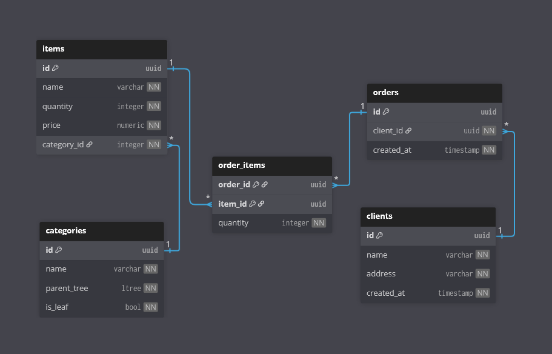

# Cервис «Добавление товара в заказ

## Задание 1 - Спроектировать схему БД

### Описание задачи

Модель данных реляционная.

Сущности

1.1. Номенклатура (наименование, кол-во, цена)

1.2. Каталог номенклатуры/Дерево категорий.

Необходимо хранить данные о категориях товара, при этом сами категории могут иметь неограниченный уровень вложенности

Схема данных категорий номенклатуры должна безболезненно позволять добавлять категории любого уровня вложенности.

На этапе проектирования максимальный
уровень вложенности неизвестен.

### Решение

Схема базы данных представлена ниже



(ключ - PK, ссылка - FK, NN - not null)

Для категорий было решено использовать расширение ltree, оно позволит добавлять категории любого уровня вложенности весьма просто. также его использование предусматривает неопределённый уровнь вложенности

Предполагается, что товары могут быть только у листьев дерева, поэтому было также добавлено поле is_leaf. Можно было бы считать это динамически из ltree, но это трудозатратно. Кроме того, по задумке он должен предотвращать появление подкатегорий у категорий, которые задумывались как листья

Для хранения заказов была создана таблица junction таблица с композитным PK - order_items. Для каждой необходимой пары заказ - товар (т. е. при каждом влючении товара в заказ), там будет создаваться новая строка. Таким образом, заказ может состоять из разного набора товаров

## Задание 2 - Написать SQL запросы

### Описание + Решение

Написать следующие SQL запросы:

2.1. Получение информации о сумме товаров заказанных под каждого клиента (Наименование клиента, сумма)

```sql
SELECT c.name, sum(i.price * oi.quantity) AS item_sum
FROM clients c
INNER JOIN client_orders co ON co.client_id = c.id
INNER JOIN order_items oi ON oi.order_id = co.order_id
INNER JOIN items i ON oi.item_id = i.id
GROUP BY c.id, c.name
```

2.2. Найти количество дочерних элементов первого уровня вложенности для категорий
номенклатуры.

```sql
SELECT parent.name, count(child.id) AS first_level_children
FROM categories parent
LEFT JOIN categories child
ON parent.parent_tree <@ child.parent_tree
AND nlevel(child.parent_tree) = nlevel(parent.parent_tree) + 1
GROUP BY parent.id, parent.name
```

2.3.

2.3.1. Написать текст запроса для отчета (view) «Топ-5 самых покупаемых товаров за
последний месяц» (по количеству штук в заказах). В отчете должны быть:
Наименование товара, Категория 1-го уровня, Общее количество проданных штук.

```sql
CREATE IF NOT EXISTS VIEW top_5_items_by_month AS
SELECT i.name,
subpath(c.parent_tree, 0, 1) AS highest_category,
SUM(oi.quantity) AS items_sold
FROM items i
INNER JOIN order_items oi ON i.id = oi.item_id
INNER JOIN categories c ON i.category_id = c.id
INNER JOIN client_orders co ON oi.order_id = co.order_id
WHERE co.created_at >= date_trunc('month', current_date) - interval '1 month'
AND co.created_at < date_trunc('month', current_date)
GROUP BY i.id, i.name, c.parent_tree
ORDER BY SUM(oi.quantity) DESC
LIMIT 5
```

2.3.2. Проанализировать написанный в п. 2.3.1 запрос и структуру БД. Предложить варианты оптимизации этого  запроса и общей схемы данных для повышения производительности системы в условиях роста данных (тысячи заказов в день)

#### Анализ запроса
Если тысячи заказов будут добавляться каждый день, order_items будет достаточно быстро расти, а запрос и кроме того требует достаточно большого JOIN'а. Плюс сумма будет идти по миллионам строк -> запрос достаточно тяжёлый
Кроме того, без индекса фильтр по дате просканирует всю таблицу, чтобы найти нужные строки
И также без индекса будут относительно медленно работать функции ltree - тут subpath

#### Оптимизации запроса и схемы БД
1) Добавить индексы. 

   На ltree поле - GIST, на created_at в client_orders - B-tree

    ```sql
    CREATE INDEX index_client_orders_created_at ON client_orders(created_at)
    
    CREATE INDEX index_categories_parent_tree ON categories USING GIST(parent_tree)
    ```

2) View можно материализовать, чтобы не вычислять каждый раз.

    Учитывая, что собирается статистика по прошлому месяцу, это более чем резонно.

    Каждый месяц потом можно просто REFRESH запускать на него через cron, например.

    ```sql
    REFRESH MATERIALIZED VIEW top_5_items_by_month
    ```

3) Можно ввести partitioning в client_orders по месяцам. Это должно неплохо ускорить запрос из 2.3.1. при больших данных

4) Также чтобы ускорить сумму из 2.3.1., можно было бы считать похожую сумму каждый день и сохранять её в таблицу (item_id, date, quantity_sold), 
а потом каждый месяц считать сумму уже по этой таблице

    Но это, наверное, уже перебор. Операция редкая, расходовать память таким образом ради неё не было бы рационально. Хватит MATERIALIZED VIEW

## Задание 3 - Написать сервис

### Описание задачи

Написать сервис «Добавление товара в заказ» который работает по REST-API.
Метод должен принимать ID заказа, ID номенклатуры и количество. Если товар уже
есть в заказе, его количество должно увеличиваться, а не создаваться новая позиция.
Если товара нет в наличии то должна возвращаться соответствующая ошибка. Стек -
любой фреймворк в пределах Python. Git репозиторий, контейнеризация,
документация, и прочее — приветствуется.

### Решение

Решением данной задачи является сервис, представленный в этом репозитории. 

**Стек: Python, FastAPI, SQLAlchemy, Alembic, Pydantic, PostgreSQL, uv, docker, docker-compose**

### Запуск

Сервис и БД были упакованы в docker контейнеры, так что чтобы запустить достаточно прописать команду:

```
docker compose  up
```

После этого должен развернуться сервис и БД

Для удобства запуска тестового задания использованное .env было загружено в репозиторий

При запуске контейнер с сервисом, так же для удобства, сначала сам запустит миграцию на базу данных, а уже потом запустится сам

### Endpoints

Так как сервис был написан на FastAPI, он предоставляет документацию API на Swagger по данному url: `http://localhost:8000/docs`

Endpoint, который было необходимо сделать по заданию:

    `POST http://localhost:8000/orders`

Как и требовалось было он принимает:
```json
{
  "order_id": "3fa85f64-5717-4562-b3fc-2c963f66afa6", // ID заказа
  "item_id": "3fa85f64-5717-4562-b3fc-2c963f66afa6", // ID номенклатуры
  "quantity": 1 // количество
}
```

Если такого ID заказа в базе не найдётся создатся новый с таким ID, если найдётся - количество увеличится на `quantity`, если хватит самого товара, а иначе - ошибка с кодом **403**. И если товара нет, вернётся **404**.

Новй заказ будет создаваться на тестового клиента, который создаётся автоматически, т. к. регистрация и в целом управление клиентами были за границами задания

Кроме запрошенного endpoint'а на добавление товара в заказ были также написаны следующие вспомогательные endpoint'ы:

- `GET http://localhost:8000/orders/all`
    
    Выведет все заказы, содержащиеся в БД, со всеми товарами в них. В нормальной обстановке он должен был бы читать клиента по JWT и возвращать только его заказы, но это за границами задания, поэтому он возвращает вообще все заказы из базы, чтобы видеть, как они создаются по endpoint'у из задания

- `GET http://localhost:8000/orders/{order_id}`
    
    Выведет вернёт заказ по id со всеми товарами в них, также для наглядности. Вернёт **404**, если заказа нет

- `POST http://localhost:8000/items/generate`
    
    Создаст заданное количество товаров со случайными данными. Т. к. в заказы нужно что-то добавлять, был добавить такой способ их добавления. Он также создаёт тестовую категорию, т. к. категории также были за границами задания, а для товаров необходима хотя бы одна

- `GET http://localhost:8000/items/all`
    
    Выведет все товары, содержащиеся в БД. Этот запрос нужен, чтобы проверить работу запроса генерации и того, что количество товаров действительно уменьшается после создания заказа

